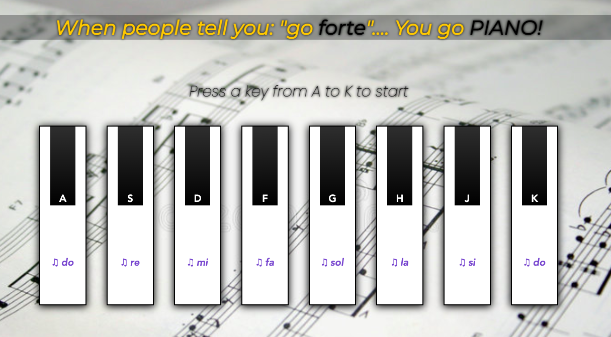

<h1 align='center'>Pianoforte</h1>

	

This app was created using only HTML, CSS and Vanilla JS.

This is a personal project, built to practice what I've learned!

It's a basic keyboard piano, suitable for basic composing from a DO to the next DO.

:link: **Live preview:** [here](https://buondevid.github.io/pianoforte/)

## Stack & Tools

- HTML
- CSS
- JS
- VS Code
- Git & GitHub + Mac Terminal

## What I learned

- Learned about custom _data_ attributes in connection with JS 
- Learned to use event listener (e.g. to put a "How to" for the webapp)
- Use for the first time a __REGEX__ expression (to match a event.property)
- Dabbled a bit with play() function and audio files
- Became a successful pianist(!!!)
- Experimented a bit with icons, ending up using plain unicode glyphs

## What could be improved

* Find more original and modern styling

## Author

:moyai: **buondevid** --> [GitHub](https://github.com/buondevid)